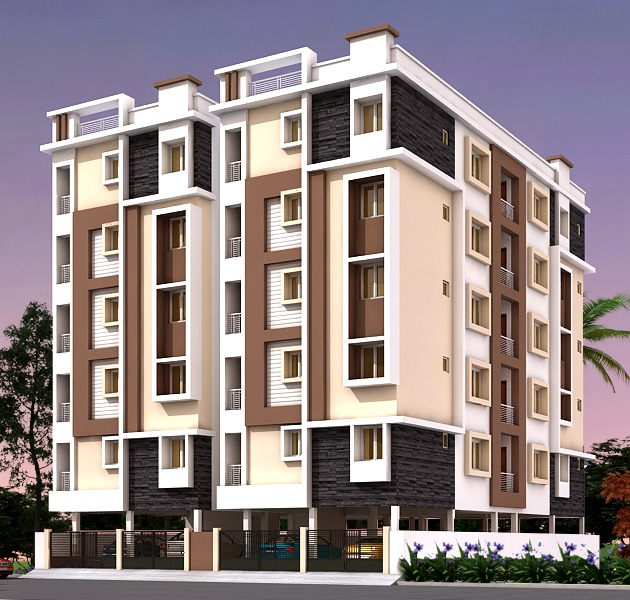

> 2BHK Residential apartments near bypass road available for sale.It has an area of 1250 sqft with a carpet area of 1150 sqft . The property is available at a price of Rs. 28.00 lac (negotiable ). It is located on the 2nd floor(out of a total of 4 floor(s)). It is facing northeast direction. The property is available on freehold. This residential complex is under-construction as of now. The expected completion date is 30/12/2020. It is well connected to the city areas. Please contact for more details. 

### Key Highlights?

- **Affordable price** - Cotact for price information.
- **Future city** - Tirupati city growing around bypass road.
- **Amenities** - Elevator, power backup, School, College, Near to Bypass Road.
- **Near By** - School, Proposed Bus stand.

